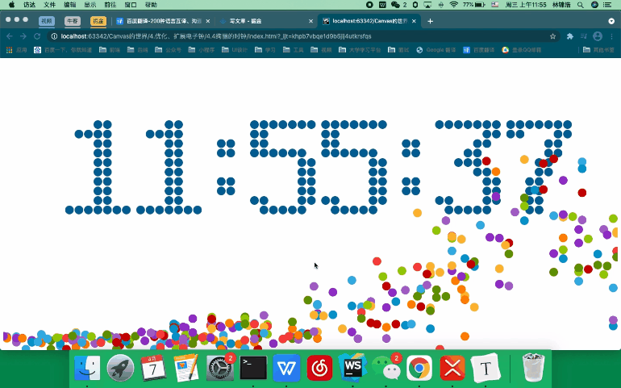

# 前言

因对于 canvas 画布在面试过程中有重复遇见，而自身也仅仅了解和学习过 canvas 的理论知识，那就那就整一个 demo 叭！

对应的文件已经整理上传到自己的仓库啦（全部注释讲解了喔）

> [gitee仓库](https://gitee.com/lin_daren/the-gorgeous-electronic-clock-of-canvas)
>
> [github仓库](https://github.com/lindadade/the-gorgeous-electronic-clock-of-canvas)




**跟随 [imooc 系列课程 ](https://www.imooc.com/video/2493)学习总结，如果有不清楚的地方，也建议跟我一样从零观看学习喔**

# Canvas 基础

## 创建 Canvas

###  HTML标签

```html
	<canvas id="canvas" width="1024" height="768" style="border: 1px solid #aaa; display: block; margin: auto auto">
		<!--兼容降错-->
		当前浏览器不支持 Canvas，请更换浏览器后再试
	</canvas>
```

*块级元素，默认 350px 宽，150px 高*

> W3C 指定应利用 width 和 height 来指定大小（画布大小和像素大小）

### Javascript

```js
const canvas = document.getElementById('canvas')
// 绘图上下文环境 2D 绘图
const context = canvas.getContext('2d')
```


## Canvas 绘制

### 绘制直线

```js
// 状态设置 - 以左上角为顶点（0, 0）
context.moveTo(100, 100)	// 笔尖移动
context.lineTo(700, 700)	// 画笔移动到这点

// 常用属性
// 笔线
context.lineWidth = 5	// 线粗
context.strokeStyle = '#005588'	// 线颜色

context.stroke()	// 开始绘制
```

### 绘制多边形

```js
// 三角形
context.moveTo(100, 100)	// 笔尖移动
context.lineTo(700, 700)	// 画笔移动到这点
context.lineTo(100, 700)	// 画笔移动到这点
context.lineTo(100, 100)	// 画笔移动到这点

// 常用属性
// 笔线
context.lineWidth = 5	// 线粗
context.strokeStyle = '#005588'	// 线颜色
// 填充
context.fillStyle = 'rgb(2, 100, 30)'	// 填充颜色
context.fill()	// 填充

context.stroke()	// 开始绘制
```

### 绘制七巧板

```js
// 七巧板线条数据
const tanGram = [
  {p: [{x: 0, y: 0}, {x: 800, y: 0}, {x: 400, y: 400}], color: '#caff67'},
  {p: [{x: 0, y: 0}, {x: 400, y: 400}, {x: 0, y: 800}], color: '#67beef'},
  {p: [{x: 800, y: 0}, {x: 800, y: 400}, {x: 600, y: 600}, {x: 600, y:200}], color: '#ef3d61'},
  {p: [{x: 600, y: 200}s, {x: 600, y: 600}, {x: 400, y: 400}], color: '#f9f51a'},
  {p: [{x: 400, y: 400}, {x: 600, y: 600}, {x: 400, y: 800}, {x: 200, y: 600}], color: '#a594c0'},
  {p: [{x: 200, y: 600}, {x: 400, y: 800}, {x: 0, y: 800}], color: '#fa8ecc'},
  {p: [{x: 800, y: 400}, {x: 800, y: 800}, {x: 400, y: 800}], color: '#f6ca29'},
]

window.onload = function() {
  // 七巧板
  const canvas = document.getElementById('canvas')
  // 绘图上下文环境 2D 绘图
  const context = canvas.getContext('2d')
  const len = tanGram.length
  // 绘画各个多边形
  for (let i = 0; i < len; i++) {
    draw(tanGram[i], context)
  }
}

function draw(piece, cxt) {
  // 开始绘制
  cxt.beginPath();
  cxt.moveTo(piece.p[0].x, piece.p[0].y)
  const len = piece.p.length
  for (let i = 1; i < len; i++) {
    cxt.lineTo(piece.p[i].x, piece.p[i].y)
  }
  // 结束绘制
  cxt.closePath()
  cxt.fillStyle = piece.color
  cxt.fill()
}
```

### 绘制弧和圆

#### 方法属性

```js
constext.arc(
	centerx, centery, radius,	// 圆心原点坐标以及半径的值
  startingAngle, endingAngle,	// 弧度值的范围
  anticlockwise = false	// 是否顺时针（可选）- 默认 false 以顺时针方向
)
```

####  弧

```js
context.lineWidth = 5
context.strokeStyle = '#005588'
context.arc(300, 300, 200, 0, 1.5 + Math.PI)
context.stroke()
```

#### 连续弧

```js
context.lineWidth = 5
context.strokeStyle = '#005588'

// 不连续弧
for (let i = 0; i < 10; i++) {
  context.beginPath()
  context.arc(50 + i*100, 60, 40, 0, 2*Math.PI*(i+1)/10)
  context.closePath()
  context.stroke()
}

// 连续弧
for (let i = 0; i < 10; i++) {
  context.beginPath()
  context.arc(50 + i*100, 180, 40, 0, 2*Math.PI*(i+1)/10)
  context.stroke()
}
```

#### 圆

```js
context.lineWidth = 5
context.strokeStyle = '#005588'

for (let i = 0; i < 10; i++) {
  context.beginPath()
  context.arc(50 + i*100, 60, 40, 0, 2*Math.PI*(i+1)/10)
  context.closePath()
	context.fill()	// 填充
}

for (let i = 0; i < 10; i++) {
  context.beginPath()
  context.arc(50 + i*100, 180, 40, 0, 2*Math.PI*(i+1)/10)
	context.fill()	// 填充
}
```


# 实现电子钟

## 绘制电子钟

### 目录结构

>  digin.js	// 存放数字的二维点阵
>
> countdown.js	// 具体逻辑
>
> index.html	// 具体页面

#### 二维点阵 - digin.js

因为数据太多，稍微拿一个进行例子

```js
// 表示 0，1 表示需绘制圆
[
  [0,0,1,1,1,0,0],
  [0,1,1,0,1,1,0],
  [1,1,0,0,0,1,1],
  [1,1,0,0,0,1,1],
  [1,1,0,0,0,1,1],
  [1,1,0,0,0,1,1],
  [1,1,0,0,0,1,1],
  [1,1,0,0,0,1,1],
  [0,1,1,0,1,1,0],
  [0,0,1,1,1,0,0]
]
```

#### 具体逻辑 - countdown.js

#### 初始化

```js
// 常量
const WINDOW_WIDTH = 1024;
const WINDOW_HEIGHT = 768;
const RADIUS = 8;
const MARGIN_TOP = 60;
const MARGIN_LEFT = 30;

window.onload = function(){
		// 初始化画布
    const canvas = document.getElementById('canvas');
    const context = canvas.getContext("2d");

    canvas.width = WINDOW_WIDTH;
    canvas.height = WINDOW_HEIGHT;

    // 绘制方法
    render( context )
}
```

#### 绘制圆点

```js
// 绘制圆点
function renderDigit( x , y , num , cxt ){
    cxt.fillStyle = "rgb(0,102,153)";

    for(let i = 0 ; i < digit[num].length ; i ++ )
        for(let j = 0 ; j < digit[num][i].length ; j ++ )
            if( digit[num][i][j] == 1 ){
                cxt.beginPath();
              	// 第（i, j）个圆的圆心位置：
              	// j*2*(R+1) => 第 j 列个的框框
              	// x: x+j*2*(R+1)+(R+1)
               	// y: y+i*2*(R+1)+(R+1)
                cxt.arc( x+j*2*(RADIUS+1)+(RADIUS+1) , y+i*2*(RADIUS+1)+(RADIUS+1) , RADIUS , 0 , 2*Math.PI )
                cxt.closePath()

                cxt.fill()
            }
}

```

#### 绘制数字圆点

```js
// 绘制数字的每一个圆点
function render( cxt ){
    let hours = 12
		let minutes = 34
		let seconds = 56

    // 1
    renderDigit( MARGIN_LEFT , MARGIN_TOP , parseInt(hours/10) , cxt )
  	// 2
    renderDigit( MARGIN_LEFT + 15*(RADIUS+1) , MARGIN_TOP , parseInt(hours%10) , cxt )
  	// ：
    renderDigit( MARGIN_LEFT + 30*(RADIUS + 1) , MARGIN_TOP , 10 , cxt )
  	// 3
    renderDigit( MARGIN_LEFT + 39*(RADIUS+1) , MARGIN_TOP , parseInt(minutes/10) , cxt);
  	// 4
    renderDigit( MARGIN_LEFT + 54*(RADIUS+1) , MARGIN_TOP , parseInt(minutes%10) , cxt);
  	// ：
    renderDigit( MARGIN_LEFT + 69*(RADIUS+1) , MARGIN_TOP , 10 , cxt);
  	// 5
    renderDigit( MARGIN_LEFT + 78*(RADIUS+1) , MARGIN_TOP , parseInt(seconds/10) , cxt);
  	// 6
    renderDigit( MARGIN_LEFT + 93*(RADIUS+1) , MARGIN_TOP , parseInt(seconds%10) , cxt);
}
```

### 时间计算

#### 初始化

```js
// 记得动态更改你的截止日期噢
const endTime = new Date(2021,3,7,0,0,0);
let curShowTimeSeconds = 0
```

#### 绘制

```js
window.onload = function(){
		// 初始化画布
    const canvas = document.getElementById('canvas');
    const context = canvas.getContext("2d");

    canvas.width = WINDOW_WIDTH;
    canvas.height = WINDOW_HEIGHT;
		curShowTimeSeconds = getCurrentShowTimeSeconds()
		render( context )
}
```

#### 获取时间数字

```js
// 获取当前时间与截止日期
function getCurrentShowTimeSeconds() {
	var curTime = new Date();
	var ret = endTime.getTime() - curTime.getTime();
	ret = Math.round( ret/1000 )

	return ret >= 0 ? ret : 0;
}
```

#### 绘制数字圆点

```js
// 更改值
let hours = parseInt( curShowTimeSeconds / 3600);
let minutes = parseInt( (curShowTimeSeconds - hours * 3600)/60 )
let seconds = curShowTimeSeconds % 60
```

> 刷新即可得到当前动态的时间数字
>
> 以此实现了电子钟


# 实现动画效果

##  时钟数字动画

### 目录结构

>  digin.js	// 存放数字的二维点阵
>
> countdown.js	// 具体逻辑
>
> index.html	// 具体页面

### 定时渲染

使用 setInterval() 来渲染动画

```js
// countdown.js

window.onload = function(){
		// 初始化画布
    const canvas = document.getElementById('canvas');
    const context = canvas.getContext("2d");

    canvas.width = WINDOW_WIDTH;
    canvas.height = WINDOW_HEIGHT;
		curShowTimeSeconds = getCurrentShowTimeSeconds()
  	// 定时渲染
		setInterval(() => {
      render( context );
      update()	// 更新函数
    }, 50)
}
```

###  更新时钟

```js
function update() {
  // 下一秒的时钟
  const nextShowTimeSeconds = getCurrentShowTimeSeconds()
  let nextHours = parseInt( nextShowTimeSeconds / 3600);
	let nextMinutes = parseInt( (nextShowTimeSeconds - nextHours * 3600)/60 )
	let nextSeconds = nextShowTimeSeconds % 60
  
  // 当前秒的时钟
  let curHours = parseInt( curShowTimeSeconds / 3600);
	let curMinutes = parseInt( (curShowTimeSeconds - curHours* 3600)/60 )
	let curSeconds = curShowTimeSeconds % 60
  
  // 更新秒钟
  if (nextShowTimeSeconds != curShowTimeSeconds) {
    curShowTimeSeconds = nextShowTimeSeconds
  }
}
```

### 更新画布

```js
function render( cxt ){

  // 对整个屏幕矩形进行刷新
	cxt.clearRect(0, 0, WINDOW_WIDTH, WINDOW_HEIGHT)

	let hours = parseInt( curShowTimeSeconds / 3600);
	let minutes = parseInt( (curShowTimeSeconds - hours * 3600)/60 )
	let seconds = curShowTimeSeconds % 60

	renderDigit( MARGIN_LEFT , MARGIN_TOP , parseInt(hours/10) , cxt )
	renderDigit( MARGIN_LEFT + 15*(RADIUS+1) , MARGIN_TOP , parseInt(hours%10) , cxt )
	renderDigit( MARGIN_LEFT + 30*(RADIUS + 1) , MARGIN_TOP , 10 , cxt )
	renderDigit( MARGIN_LEFT + 39*(RADIUS+1) , MARGIN_TOP , parseInt(minutes/10) , cxt);
	renderDigit( MARGIN_LEFT + 54*(RADIUS+1) , MARGIN_TOP , parseInt(minutes%10) , cxt);
	renderDigit( MARGIN_LEFT + 69*(RADIUS+1) , MARGIN_TOP , 10 , cxt);
	renderDigit( MARGIN_LEFT + 78*(RADIUS+1) , MARGIN_TOP , parseInt(seconds/10) , cxt);
	renderDigit( MARGIN_LEFT + 93*(RADIUS+1) , MARGIN_TOP , parseInt(seconds%10) , cxt);
}
```


## 小球动画

```html
<!DOCTYPE html>
<html lang="en">
<head>
	<meta charset="UTF-8">
	<title>Title</title>
</head>
<body>
<canvas id="canvas" width="1024" height="768" style="border: 1px solid #aaa; display: block; margin: auto auto">
	<!--兼容降错-->
	当前浏览器不支持 Canvas，请更换浏览器后再试
</canvas>

<script>
// 初始化小球
const ball = { x: 512, y: 100, r: 20, g: 2, vx: -4, vy: 0, color: '#005588' }
window.onload = function() {
	const canvas = document.getElementById('canvas')
	// 绘图上下文环境 2D 绘图
	const context = canvas.getContext('2d')

	// 定时器动画
	setInterval(() => {
		// 渲染
		render(context)
		// 更新
		update()
	}, 50)
}
// 动画
function update() {
	ball.x += ball.vx
	ball.y += ball.vy
	ball.vy += ball.g

	// 碰撞底部
	if (ball.y >= 768 - ball.r) {
		ball.y = 768 - ball.r
		ball.vy = -ball.vy*0.6	// 摩擦力
	}
}
function render(ctx) {
	// 刷新 canvas 画布
	ctx.clearRect(0, 0, ctx.canvas.width, ctx.canvas.height)
	ctx.fillStyle = ball.color
	ctx.beginPath()
	ctx.arc(ball.x, ball.y, ball.r, 0, 2*Math.PI)
	ctx.closePath()
	ctx.fill()
}
</script>
</body>
</html>

```


## 时钟小球动画

### 目录结构

>  digin.js	// 存放数字的二维点阵
>
> countdown.js	// 具体逻辑
>
> index.html	// 具体页面

### 初始化数据

```js
// 常量
const WINDOW_WIDTH = 1024;
const WINDOW_HEIGHT = 768;
const RADIUS = 8;
const MARGIN_TOP = 60;
const MARGIN_LEFT = 30;

const endTime = new Date(2021,3,7,0,0,0);
let curShowTimeSeconds = 0

// 存放小球
const balls = [];
// 更换颜色
const colors = ["#33B5E5","#0099CC","#AA66CC","#9933CC","#99CC00","#669900","#FFBB33","#FF8800","#FF4444","#CC0000"]
```

### 更新小球

```js
function update() {
	// 下一秒的时钟
	const nextShowTimeSeconds = getCurrentShowTimeSeconds()
	let nextHours = parseInt(nextShowTimeSeconds / 3600);
	let nextMinutes = parseInt((nextShowTimeSeconds - nextHours * 3600) / 60)
	let nextSeconds = nextShowTimeSeconds % 60

	// 当前秒的时钟
	let curHours = parseInt(curShowTimeSeconds / 3600);
	let curMinutes = parseInt((curShowTimeSeconds - curHours * 3600) / 60)
	let curSeconds = curShowTimeSeconds % 60

	// 更新秒钟
	if (nextShowTimeSeconds != curShowTimeSeconds) {
    // 对 6 个数字一起判断更新
		if (parseInt(curHours / 10) != parseInt(nextHours / 10)) {
      // 添加小球
			addBalls(MARGIN_LEFT + 0, MARGIN_TOP, parseInt(curHours / 10));
		}
		if (parseInt(curHours % 10) != parseInt(nextHours % 10)) {
			addBalls(MARGIN_LEFT + 15 * (RADIUS + 1), MARGIN_TOP, parseInt(curHours / 10));
		}
		if (parseInt(curMinutes / 10) != parseInt(nextMinutes / 10)) {
			addBalls(MARGIN_LEFT + 39 * (RADIUS + 1), MARGIN_TOP, parseInt(curMinutes / 10));
		}
		if (parseInt(curMinutes % 10) != parseInt(nextMinutes % 10)) {
			addBalls(MARGIN_LEFT + 54 * (RADIUS + 1), MARGIN_TOP, parseInt(curMinutes % 10));
		}
		if (parseInt(curSeconds / 10) != parseInt(nextSeconds / 10)) {
			addBalls(MARGIN_LEFT + 78 * (RADIUS + 1), MARGIN_TOP, parseInt(curSeconds / 10));
		}
		if (parseInt(curSeconds % 10) != parseInt(nextSeconds % 10)) {
			addBalls(MARGIN_LEFT + 93 * (RADIUS + 1), MARGIN_TOP, parseInt(nextSeconds % 10));
		}

		curShowTimeSeconds = nextShowTimeSeconds;
	}
	// 更新球
	updateBalls();
}
```

### 添加小球

```js
// 添加小球
function addBalls(x, y, num) {
	for (let i = 0; i < digit[num].length; i++)
		for (let j = 0; j < digit[num][i].length; j++)
			if (digit[num][i][j] == 1) {
				const aBall = {
          // 原点
					x: x + j * 2 * (RADIUS + 1) + (RADIUS + 1),
					y: y + i * 2 * (RADIUS + 1) + (RADIUS + 1),
          // 动画随机设计
					g: 1.5 + Math.random(),
					vx: Math.pow(-1, Math.ceil(Math.random() * 1000)) * 4,
					vy: -5,
					color: colors[Math.floor(Math.random() * colors.length)]
				}

				balls.push(aBall)
			}
}
```

### 更新小球运动

```js
// 更新小球运动
function updateBalls() {
	for (let i = 0; i < balls.length; i++) {
		balls[i].x += balls[i].vx;
		balls[i].y += balls[i].vy;
		balls[i].vy += balls[i].g;

    // 碰撞检测
		if (balls[i].y >= WINDOW_HEIGHT - RADIUS) {
			balls[i].y = WINDOW_HEIGHT - RADIUS;
			balls[i].vy = -balls[i].vy * 0.75;
		}
	}
}
```

### 绘制小球

```js
// 绘制数字的每一个圆点
function render(cxt) {

	// 对整个屏幕矩形进行刷新
	cxt.clearRect(0, 0, WINDOW_WIDTH, WINDOW_HEIGHT)

	let hours = parseInt(curShowTimeSeconds / 3600);
	let minutes = parseInt((curShowTimeSeconds - hours * 3600) / 60)
	let seconds = curShowTimeSeconds % 60

	renderDigit(MARGIN_LEFT, MARGIN_TOP, parseInt(hours / 10), cxt)
	renderDigit(MARGIN_LEFT + 15 * (RADIUS + 1), MARGIN_TOP, parseInt(hours % 10), cxt)
	renderDigit(MARGIN_LEFT + 30 * (RADIUS + 1), MARGIN_TOP, 10, cxt)
	renderDigit(MARGIN_LEFT + 39 * (RADIUS + 1), MARGIN_TOP, parseInt(minutes / 10), cxt);
	renderDigit(MARGIN_LEFT + 54 * (RADIUS + 1), MARGIN_TOP, parseInt(minutes % 10), cxt);
	renderDigit(MARGIN_LEFT + 69 * (RADIUS + 1), MARGIN_TOP, 10, cxt);
	renderDigit(MARGIN_LEFT + 78 * (RADIUS + 1), MARGIN_TOP, parseInt(seconds / 10), cxt);
	renderDigit(MARGIN_LEFT + 93 * (RADIUS + 1), MARGIN_TOP, parseInt(seconds % 10), cxt);

  // 绘制小球
	for (let i = 0; i < balls.length; i++) {
		cxt.fillStyle = balls[i].color;

		cxt.beginPath();
		cxt.arc(balls[i].x, balls[i].y, RADIUS, 0, 2 * Math.PI, true);
		cxt.closePath();

		cxt.fill();
	}
}
```


# 优化、扩展时钟

## 性能优化

### 目录结构

>  digin.js	// 存放数字的二维点阵
>
> countdown.js	// 具体逻辑
>
> index.html	// 具体页面

### 实现

> 问题：balls 的数组在不断地增加，终究会有极限。

> 解决：当小球运动出 canvas 画布时，应该删除掉对应的小球。
>
> 该小球数组应只存在画布出现的小球（会越来越慢和卡）

```js
// 更新小球运动
function updateBalls() {
	for (let i = 0; i < balls.length; i++) {
		balls[i].x += balls[i].vx;
		balls[i].y += balls[i].vy;
		balls[i].vy += balls[i].g;

		if (balls[i].y >= WINDOW_HEIGHT - RADIUS) {
			balls[i].y = WINDOW_HEIGHT - RADIUS;
			balls[i].vy = -balls[i].vy * 0.75;
		}
	}

  // 数量初始化为 0 => 确立还有多少个小球保留在画布中
	let cnt = 0
	for( let i = 0 ; i < balls.length ; i ++ )
    // 是否在画布中
		if( balls[i].x + RADIUS > 0 && balls[i].x -RADIUS < WINDOW_WIDTH )
      // 是则添加小球
			balls[cnt++] = balls[i]
	// 只保留存在画布的小球
	while( balls.length > cnt ){
		balls.pop();
	}
}
```


## 屏幕自适应

让初始化的常量根据当前屏幕来自适应即可。

> 将 DOM 元素宽高撑起来以便获取

```html
<!DOCTYPE html>
<html style="height: 100%;">
<head lang="en">
    <meta charset="UTF-8">
    <title></title>
</head>
<body style="height: 100%;">
    <canvas id="canvas" style="height: 100%;">
        当前浏览器不支持Canvas，请更换浏览器后再试
    </canvas>

    <script src="digit.js"></script>
    <script src="countdown.js"></script>
</body>
</html>

```

> 动态定义画布初始化变量

```js
// countdown.js

// 常量
let WINDOW_WIDTH = 1024;
let WINDOW_HEIGHT = 768;
let RADIUS = 8;
let MARGIN_TOP = 60;
let MARGIN_LEFT = 30;

const endTime = new Date(2021, 3, 8, 0, 0, 0);
let curShowTimeSeconds = 0

// 存放小球
const balls = [];
// 更换颜色
const colors = ["#33B5E5", "#0099CC", "#AA66CC", "#9933CC", "#99CC00", "#669900", "#FFBB33", "#FF8800", "#FF4444", "#CC0000"]

window.onload = function () {
  // 根据用户屏幕来自定义常量
  WINDOW_WIDTH = document.body.clientWidth;
  WINDOW_HEIGHT = document.body.clientHeight;
  MARGIN_LEFT = Math.round(WINDOW_WIDTH/10);
  // 根据 renderDigit 的 x 来进行判断
  RADIUS = Math.round(WINDOW_WIDTH * 4 / 5 / 108)-1
  MARGIN_TOP = Math.round(WINDOW_HEIGHT / 5)
  
	// 初始化画布
	const canvas = document.getElementById('canvas');
	const context = canvas.getContext("2d");

	canvas.width = WINDOW_WIDTH;
	canvas.height = WINDOW_HEIGHT;
	curShowTimeSeconds = getCurrentShowTimeSeconds()
	// 定时渲染
	setInterval(() => {
		render(context);
		update()	// 更新函数
	}, 50)
}
```

## 归零时间更新

> 问题：若定义的 endTime 至今小于 99 个小时 => 则返回 00:00:00

> 解决：动态获取 endTime

```js
// 当前时间增加一小时
let endTime = new Date()
endTime.setTime(endTime.getTime() + 3600 * 1000)
```

## 绚丽时钟效果

可以来做当前时钟的效果，不止是倒计时

> 重点在 getCurrentShowTimeSecond() 中，返回今天已经走过了多久即可。

```js
// 获取当前时间
function getCurrentShowTimeSeconds() {
	let curTime = new Date();
  // 存的是今天已经走过了多久 => 时钟
	let ret = curTime.getHours() * 3600 + curTime.getMinutes() * 60 + curTime.getSeconds()

	return ret
}
```


# 总结

放上 [canvas Api](https://www.canvasapi.cn/)

以下将本次学习课程中使用常见的方法和属性再次整理回顾。

## Canvas

### HTML

- <canvas id="canvas"></canvas>

### JavaScript

- ```js
  const canvas = document.getElementById('canvas')	// 获取 canvas 元素
  const context = canvas.getContext('2d')	// 获取上下文来进行绘制
  ```

- 常用属性

```js
// 当前画布的宽高
canvas.width
canvas.height

```

- 常用方法

```js
// 获取当前画布的上下文
canvas.getContext('2d')
```


## Context

- 常用属性

```js
// 笔线宽
context.lineWidth

// 笔线颜色
context.strokeStyle

// 填充色
context.fillStyle

// 该上下文对应的 canvas 画布
context.canvas

```

- 常用方法

```js
// 移动笔尖
context.moveTo(x, y)

// 画线
context.lineTo(x, y)

// 画弧
context.arc(cx, cy, r, sAng, eAng, anticlock = false)

// 开始描绘
context.beginPath()

// 结束描绘
context.closePath()

// 绘制笔线颜色
context.stroke()

// 填充颜色
context.fill()

// 刷新矩形区域
context.clearRect(x, y, width, height)
```

# 后记

加油～

整理自己的前端体系架构，然后找到一个好实习！